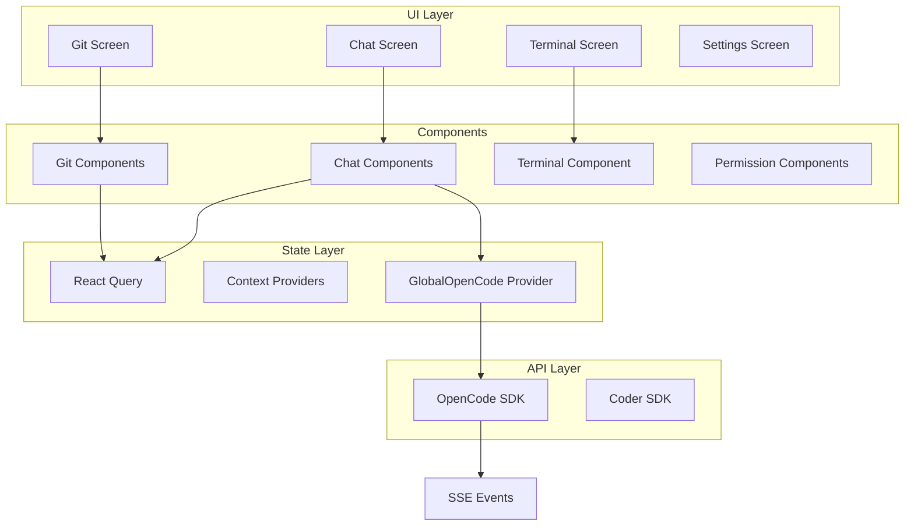

# Detailed Design: OpenChamber Feature Integration

## Overview

Clone all OpenChamber features into the Opencoder React Native app, maintaining full feature parity across mobile, web, and desktop platforms. The integration will incrementally replace existing code while leveraging the current architecture (Context API + React Query, Uniwind components, Expo Router).

## Detailed Requirements

### Feature Scope
All OpenChamber features must be implemented:
- **Chat**: Streaming responses, message parts (text, diff, tool, file, patch, snapshot), branching, diff previews
- **Git**: Operations, identity management, AI commit generation (remote execution via opencode PTY)
- **Terminal**: ghostty-web with Expo 'use dom' directive
- **Permissions**: Rich UI for agent/tool requests
- **Multi-Agent**: Runs with isolated worktrees, manager UI
- **Task Tracker**: Live progress, todo list
- **Settings**: Providers, MCP, skills, models, UI scaling
- **Real-time**: SSE streaming for all events

### Technical Constraints
- **State Management**: Context API + React Query (no Zustand)
- **Components**: Rebuild with existing Uniwind components (no @opencode-ai/ui)
- **Terminal**: ghostty-web with 'use dom' in separate file
- **Implementation**: Incremental replacement of existing code
- **Platforms**: Full feature parity on mobile, web, desktop
- **SSE**: Extend GlobalOpenCodeProvider for all event types
- **Testing**: Unit tests + Detox E2E

## Architecture Overview



## Components and Interfaces

### Chat System

#### Components
```
apps/native/components/chat/
├── ChatContainer.tsx           # Main chat wrapper
├── MessageList.tsx             # Message rendering
├── ChatInput.tsx               # Input with autocomplete
├── message/
│   ├── ChatMessage.tsx         # Single message
│   ├── MessageHeader.tsx       # Metadata, status
│   ├── MessageBody.tsx         # Content wrapper
│   └── parts/
│       ├── AssistantText.tsx   # Text responses
│       ├── UserText.tsx        # User messages
│       ├── DiffPreview.tsx     # Diff display
│       ├── ToolUse.tsx         # Tool invocation
│       ├── FilePart.tsx        # File content
│       ├── Reasoning.tsx       # Thinking display
│       └── StepProgress.tsx    # Step tracking
├── PermissionRequest.tsx       # Permission UI
└── QuestionCard.tsx            # Agent questions
```

#### State
```typescript
// Query keys for chat
const chatKeys = {
  sessions: (workspaceId: string) => ['sessions', workspaceId],
  session: (id: string) => ['session', id],
  messages: (sessionId: string) => ['messages', sessionId],
  stream: (sessionId: string) => ['stream', sessionId],
}

// Mutations
const useCreateSession = () => useMutation({...})
const useSendMessage = () => useMutation({...})
const useForkSession = () => useMutation({...})
```

#### SSE Event Handlers
```typescript
// Extend GlobalOpenCodeProvider
type ChatEventHandler = {
  onMessageUpdated: (event: EventMessageUpdated) => void
  onMessagePartUpdated: (event: EventMessagePartUpdated) => void
  onSessionCreated: (event: EventSessionCreated) => void
  onSessionStatus: (event: EventSessionStatus) => void
}
```

### Git Operations

#### Components
```
apps/native/components/git/
├── GitView.tsx                # Main git screen
├── GitStatus.tsx              # Status display
├── GitIdentity.tsx            # Identity management
├── CommitEditor.tsx           # AI commit gen UI
└── DiffViewer.tsx             # Diff visualization
```

#### API Layer
```typescript
// All git operations via opencode server
const gitApi = {
  getStatus: (projectId: string) => Promise<GitStatus>
  commit: (projectId: string, message: string) => Promise<void>
  push: (projectId: string) => Promise<void>
  pull: (projectId: string) => Promise<void>
  createBranch: (projectId: string, name: string) => Promise<void>
  // All executed via PTY on remote server
}
```

### Terminal

#### Component
```
apps/native/components/terminal/
└── Terminal.tsx               // 'use dom' at top
```

```typescript
// apps/native/components/terminal/Terminal.tsx
'use dom'

import { Terminal } from 'ghostty-web'

export function TerminalView({ ptyId }: { ptyId: string }) {
  return <Terminal id={ptyId} />
}
```

#### Integration
- PTY spawned via OpenCode SDK `/pty` endpoint
- Output streamed via SSE `EventPtyCreated`
- Input sent via `/pty/{id}/write`

### Permissions & Questions

#### Components
```
apps/native/components/permissions/
├── PermissionRequest.tsx       # Main permission UI
├── PermissionCard.tsx          # Single permission
└── QuestionCard.tsx            # Agent question
```

#### State
```typescript
const usePermissionStore = (sessionId: string) => {
  return useQuery({
    queryKey: ['permissions', sessionId],
    queryFn: () => fetchPermissions(sessionId),
  })
}

const useApprovePermission = () => useMutation({...})
const useDenyPermission = () => useMutation({...})
```

### Multi-Agent & Task Tracker

#### Components
```
apps/native/components/agent/
├── MultiRunView.tsx            # Multi-agent manager
├── AgentCard.tsx               # Single agent status
├── TaskTracker.tsx             # Task progress
└── TodoList.tsx                # Todo items
```

### Settings

#### Components
```
apps/native/components/settings/
├── SettingsView.tsx            # Main settings
├── ProvidersSection.tsx        # OAuth/API config
├── McpSection.tsx              # MCP servers
├── ModelsSection.tsx           # Model selection
├── SkillsSection.tsx           # Skills catalog
└── AppearanceSection.tsx       # UI scaling
```

## Data Models

### Session
```typescript
interface Session {
  id: string
  projectId: string
  status: 'running' | 'completed' | 'aborted'
  summary?: string
  stats: {
    tokensUsed: number
    duration: number
  }
  createdAt: string
  updatedAt: string
}
```

### Message
```typescript
interface Message {
  id: string
  sessionId: string
  role: 'user' | 'assistant' | 'system'
  parts: MessagePart[]
  createdAt: string
}

type MessagePart =
  | { type: 'text'; content: string }
  | { type: 'diff'; content: DiffContent }
  | { type: 'tool'; tool: string; input: unknown }
  | { type: 'file'; path: string; content: string }
  | { type: 'reasoning'; content: string }
  | { type: 'step-start'; step: string }
  | { type: 'step-finish'; result: unknown }
```

### Permission
```typescript
interface Permission {
  id: string
  sessionId: string
  type: 'tool' | 'file' | 'command'
  description: string
  status: 'pending' | 'approved' | 'denied'
}
```

## Error Handling

### API Errors
```typescript
// Query error boundary
export function QueryErrorBoundary({ children }: { children: ReactNode }) {
  return (
    <ErrorBoundary
      fallback={(error) => <ErrorDisplay error={error} />}
    >
      {children}
    </ErrorBoundary>
  )
}
```

### SSE Reconnection
```typescript
// In GlobalOpenCodeProvider
useEffect(() => {
  let retryCount = 0
  const maxRetries = 5

  const connect = () => {
    const eventSource = new EventSource(url)
    eventSource.onerror = () => {
      if (retryCount < maxRetries) {
        setTimeout(() => {
          retryCount++
          connect()
        }, 1000 * retryCount)
      }
    }
  }

  connect()
}, [workspaceId])
```

### Mutation Errors
```typescript
// Toast notifications for errors
const useSendMessage = () => {
  return useMutation({
    mutationFn: sendMessage,
    onError: (error) => {
      toast.show('Failed to send message', { type: 'error' })
    }
  })
}
```

## Testing Strategy

### Unit Tests
```bash
# Components
__tests__/components/chat/ChatInput.test.tsx
__tests__/components/git/GitStatus.test.tsx

# Hooks
__tests__/hooks/useChatMessages.test.ts
__tests__/hooks/useGitOperations.test.ts

# Utilities
__tests__/lib/diffUtils.test.ts
```

### E2E Tests (Detox)
```bash
e2e/
├── chat.e2e.ts                # Chat flow
├── git.e2e.ts                 # Git operations
└── permissions.e2e.ts         # Permission handling
```

## Appendices

### Technology Choices

| Choice | Rationale |
|--------|-----------|
| Context API + React Query | Matches existing architecture, avoids adding Zustand |
| Uniwind components | Consistent with current app styling |
| ghostty-web + 'use dom' | Enables web terminal in React Native |
| Extend GlobalOpenCodeProvider | Reuses existing SSE infrastructure |
| Detox for E2E | React Native standard for E2E testing |

### Research Findings

**OpenChamber**: 24 Zustand stores, full-featured UI, Radix components
**Opencode Desktop**: Tauri wrapper, spawns server, uses @opencode-ai/app/ui
**Current App**: Context + React Query, basic integration, MMKV storage

### Alternative Approaches Considered

| Approach | Status |
|----------|--------|
| Use @opencode-ai/ui directly | Rejected - Would break app consistency |
| Add Zustand for new features | Rejected - Unnecessary complexity |
| WebSocket instead of SSE | Rejected - SSE works fine, simpler |
| Big-bang replacement | Rejected - Incremental is safer |

### Key Constraints

- Git runs remotely (PTY on opencode server)
- Terminal must use 'use dom' directive
- Full feature parity across platforms
- No new state management libraries
