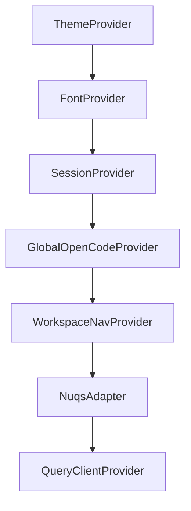

# Current Opencoder App Architecture Research

## Overview
React Native (Expo) app with web/desktop support, built with Bun, TypeScript, MMKV storage, and Nitro Modules.

## Component System

**Location**: `apps/native/components/`

### Structure
```
components/
├── sidebar/ - Desktop shell, headers, session lists, resize handles
├── projects-list/ - Agent status, project sections, list utilities
├── workspace-mockups/ - Workspace cards, shared UI, mock data
├── auth/ - Authentication components
└── Shared: app-text.tsx, button.tsx, container.tsx, select.tsx, dialog.tsx
```

**Approach**: Functional components with Uniwind (Tailwind v4) utility-first styling

## Current Workspace Integration

### Core Files
- `lib/opencode-provider.tsx` - Global OpenCode client connections, SSE events
- `lib/opencode-client.ts` - OpenCode API client wrapper
- `lib/workspace-apps.ts` - OpenCode app discovery and URL resolution

### Queries
- `lib/workspace-queries.ts` - Workspace data with status, badges, formatting
- `lib/project-queries.ts` - OpenCode projects list
- `lib/session-queries.ts` - OpenCode sessions, mutations

### Navigation Structure
```mermaid
graph TD
    A[Root Layout] --> B[App Layout - Auth]
    B --> C[Drawer Layout]
    C --> D[index - Home]
    C --> E[(tabs) - Tabs]
    C --> F[workspaces - List]
    C --> G[workspaces/[workspaceId]/[projectId]/[sessionId]]
    C --> H[sign-in]
    C --> I[modal]
```

## State Management

**No Redux** - Pure Context API + React Query

### Provider Hierarchy


1. **ThemeProvider** - Theme mode, name, preference
2. **FontProvider** - Font families, flavors
3. **SessionProvider** - Session token, base URL
4. **GlobalOpenCodeProvider** - Workspace connections map, SSE events
5. **WorkspaceNavProvider** - Selected workspace/project/session
6. **NuqsAdapter** - URL query state
7. **QueryClientProvider** - React Query

### Storage
- MMKV (native) / localStorage (web)
- Centralized `storage` object

## OpenCode Integration

### SDK
- `@opencode-ai/sdk` from npm
- `createCoderOpenCodeClient` wrapper for authentication

### Features Implemented
- Workspace connection pooling with SSE streaming
- Auto-discovery of OpenCode app in workspace
- Project/session listing
- Session creation mutation
- Real-time event subscription per workspace

### Configuration
- `OPENCODE_APP_SLUG = "opencode"`
- Default port: 4096
- Web proxy: `/api/opencode` with `X-Proxy-Target` header

## Key Dependencies

| Package | Purpose |
|---------|---------|
| `@tanstack/react-query` | Data fetching/mutations |
| `@opencode-ai/sdk` | OpenCode API |
| `@coder/sdk` | Coder API |
| `expo-router` | Routing |
| `react-native-mmkv` | Storage |
| `nuqs` | URL state |
| Uniwind (Tailwind v4) | Styling |

## Navigation Type

- **Primary**: Expo Router (file-based)
- **Secondary**: React Navigation 7 (Stack + Drawer)
- **Desktop Conditional**: DesktopShell wraps navigation for breakpoints >= md

## Existing Routes

| Route | Purpose |
|-------|---------|
| `(drawer)/index` | Home |
| `(drawer)/(tabs)` | Tabs |
| `workspaces` | Workspaces list |
| `workspaces/[workspaceId]/[projectId]/[sessionId]` | Chat session |
| `sign-in` | Authentication |
| `modal` | Modal screen |
