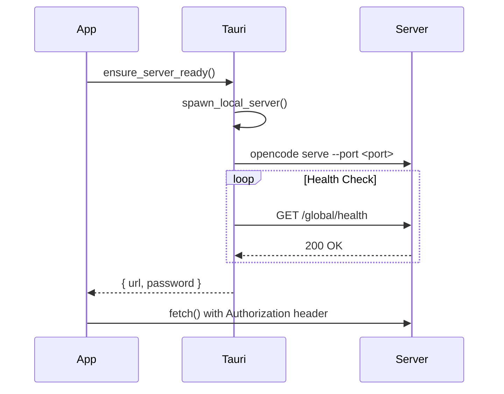

# Opencode Desktop App Research

## Overview
Tauri v2 desktop app with Rust backend that wraps opencode SDK.

## Architecture

### Frontend (`src/index.tsx`)
- **Platform Interface**: Wraps opencode SDK's `Platform` interface
- **Dependencies**: `@opencode-ai/app` (workspace), `@opencode-ai/ui` (workspace)

### Backend (`src-tauri/src/lib.rs`)
- Spawns local opencode server via CLI: `opencode serve --port <port>`
- Falls back to custom configured servers
- Server health checking via `/global/health` endpoint
- Optional authentication with Basic Auth (`opencode:{password}`)

## Connection Flow



## Authentication Flow

```typescript
fetch(input, init) {
  const pw = password()
  const headers = new Headers(init?.headers)
  headers.append("Authorization", `Basic ${btoa("opencode:${pw}")}`)
  return tauriFetch(input, { ...init, headers })
}
```

## Key Components

### Frontend (`src/index.tsx`)
- `createPlatform()` - Desktop platform adapter:
  - File dialogs (directory, file, save)
  - Storage layer (debated, 250ms write debounce)
  - Update checker/downloader
  - Notification system
  - Custom `fetch()` with auth injection
  - Server URL persistence
- `ServerGate` - Waits for server ready via `ensure_server_ready()`
- `createMenu()` - macOS menu bar

### Backend (`src-tauri/src/lib.rs`)
- `run()` - Main app initialization
- `setup_server_connection()` - Custom URL or local server
- `spawn_local_server()` - Spawns opencode CLI with auth
- `check_server_health()` - HTTP health check
- `kill_sidecar()` - Terminates server process

### CLI Handler (`src-tauri/src/cli.rs`)
- `install_cli()` - Installs opencode binary
- `sync_cli()` - Version check and update
- `create_command()` - Process with env vars:
  - `OPENCODE_EXPERIMENTAL_ICON_DISCOVERY=true`
  - `OPENCODE_CLIENT=desktop`
  - `XDG_STATE_HOME`

## Tauri Commands

| Command | Description |
|---------|-------------|
| `ensure_server_ready` | Returns `{ url, password }` |
| `get_default_server_url` | Retrieves persisted server URL |
| `set_default_server_url` | Persists server URL |
| `kill_sidecar` | Kills opencode server |
| `install_cli` | Installs CLI binary |

## Storage System

Custom AsyncStorage over Tauri Store:
- Write debouncing (250ms)
- Three-tier cache: Store → Memory → Create
- Flush method for manual sync

## Key Takeaways for Integration

1. **SDK Usage**: Uses `@opencode-ai/app` and `@opencode-ai/ui` workspace packages
2. **Server Management**: Spawns local server, health checks, auth injection
3. **Platform Adapter**: Custom implementation of `Platform` interface
4. **Storage**: Custom AsyncStorage wrapper with debouncing
