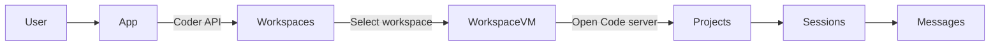
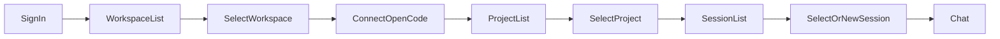
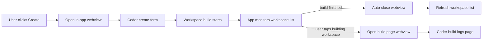
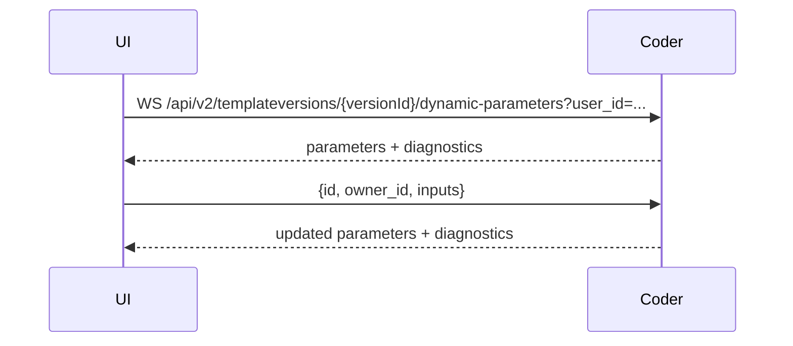
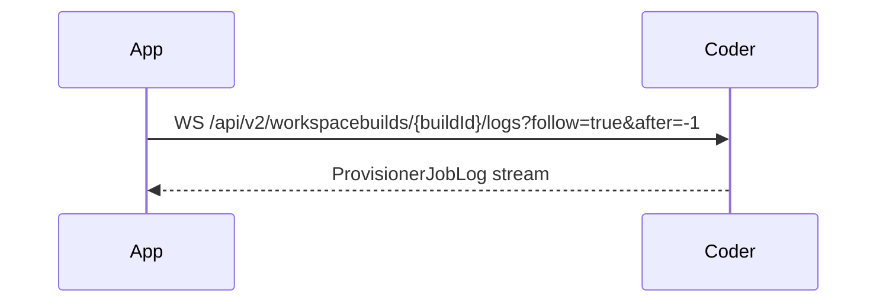
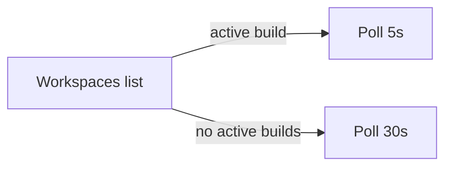

# Workspace Navigation Design (Draft)

Date: 2025-12-29
Status: Draft

## Goals
- Show Coder workspaces after sign-in.
- Use TanStack Query for Coder API fetches.
- Open projects via Open Code server per workspace.
- Drill into sessions and messages.
- Use TanStack Query for all Coder API calls.

## Non-goals
- Message composer details.
- Auth flow details.

## Core model
- Workspace (Coder VM) -> Projects -> Sessions -> Messages.
- One workspace has many projects.
- One project has many sessions.

Plain flow:
- User -> App -> Coder API -> Workspaces.
- Select workspace -> Open Code server -> Projects.
- Select project -> Sessions -> Messages.

## Data fetching rules
- Use TanStack Query for all Coder API calls.
- Keep each Coder API call in a dedicated hook.
- Use query keys that include baseUrl + session + user scope.
- Use staleTime and refetchOnFocus defaults from existing app patterns.
- Use query error state to drive ListState error UI.
- Never call Coder API directly in components.




## Breakpoints
- Desktop: >= 1024px.
- Tablet: 768-1023px.
- Phone: < 768px.

## Layout per breakpoint
- Desktop: Sidebar 1 shows workspaces. Expand to show projects. Select project. Sidebar 2 shows sessions. Main shows chat.
- Tablet: Same two sidebars. More compact. Same behavior.
- Phone: Separate screens: Workspaces -> Projects -> Sessions -> Chat.

## Sidebar 1: workspace row fields (baseline)
- Name.
- Status (running/starting/stopped/etc) with spinner when active.
- Last used (relative).
- Owner + avatar.
- Badges: favorite, outdated, task, shared.
- Hidden by default: template name, org name.

```mermaid
flowchart TB
  subgraph Desktop[Desktop: two sidebars]
    D1[Sidebar 1: Workspaces list] --> D1a[Expanded workspace -> Projects]
    D1a --> D2[Sidebar 2: Sessions list]
    D2 --> D3[Chat view]
  end
  subgraph Tablet[Tablet: two sidebars (compact)]
    T1[Sidebar 1: Workspaces list] --> T1a[Expanded workspace -> Projects]
    T1a --> T2[Sidebar 2: Sessions list]
    T2 --> T3[Chat view]
  end
  subgraph Phone[Phone: stacked screens]
    P1[Workspaces screen] --> P2[Projects screen] --> P3[Sessions screen] --> P4[Chat screen]
  end
end
```


## User flow
Plain flow:
- Sign in -> Workspaces list.
- Select workspace -> Connect Open Code -> Projects list.
- Select project -> Sessions list.
- Select or create session -> Chat.



## Decision
- Option A selected.
- Desktop and tablet: persistent nav with two sidebars.
- Phone: stacked screens.
- Use TanStack Query for all Coder API reads and mutations.

## Wireframes (MVP)

### Desktop (>= 1024px)
```
+--------------------------------------------------------------------------------------------------+
| Top bar: App name | Account | Sync/Status                                                        |
+--------------------------------------------------------------------------------------------------+
| Sidebar 1: Workspaces                     | Sidebar 2: Sessions          | Main: Chat             |
| [Create +]                               | [Session A]                   | [Project / Session]    |
| [Workspace Row]                          | [Session B]                   | ---------------------- |
|  - Name                                  | [Session C]                   | [Messages list]        |
|  - Status + spinner                      | [New Session +]               | [Message bubbles]      |
|  - Last used                             |                               | [Message bubbles]      |
|  - Owner avatar                          |                               |                        |
|  - Badges                                |                               | [Composer]             |
|  > Projects (expanded)                   |                               |                        |
|    - Project 1                           |                               |                        |
|    - Project 2                           |                               |                        |
+--------------------------------------------------------------------------------------------------+
```

### Tablet (768px - 1023px)
```
+----------------------------------------------------------------------------------------------+
| Top bar: App name | Account | Sync/Status                                                    |
+----------------------------------------------------------------------------------------------+
| Workspaces (compact)              | Sessions (compact)          | Chat                        |
| [Create +]                        | [Session A]                 | [Project / Session]         |
| [WS Name • Status]                | [Session B]                 | --------------------------- |
|  > Projects                        | [New +]                     | [Messages list]             |
|   - P1                              |                             | [Composer]                  |
|   - P2                              |                             |                             |
+----------------------------------------------------------------------------------------------+
```

### Phone (< 768px)
```
Workspaces Screen
+--------------------------------------+
| Workspaces        [Create +]         |
| [WS Name] [Status] [Last used]       |
| [WS Name] [Status] [Last used]       |
+--------------------------------------+

Projects Screen
+--------------------------------------+
| < Workspaces    Projects             |
| [Project 1]                          |
| [Project 2]                          |
+--------------------------------------+

Sessions Screen
+--------------------------------------+
| < Projects      Sessions             |
| [Session A]                          |
| [Session B]          [New +]          |
+--------------------------------------+

Chat Screen
+--------------------------------------+
| < Sessions      Project / Session    |
| [Messages list]                       |
| [Composer]                            |
+--------------------------------------+
```

## Design system alignment (theme-agnostic)
This work should remain theme-agnostic and only use existing tokens, themes, and primitives.

Theme and token usage
- Use semantic tokens and theme variables from `apps/native/global.css` and `apps/native/themes/*.css`.
- Avoid hardcoded colors. Use semantic token classes like `bg-background`, `bg-surface-*`, `text-foreground-*`, `border-*`, `icon-*`, and `input-*`.
- Color roles: `--color-background`, `--color-surface`, `--color-foreground`, `--color-border`, `--color-icon`, `--color-input`, `--color-success`, `--color-warning`, `--color-critical`, `--color-info`, `--color-brand`, `--color-interactive`.

Typography
- Use `--font-sans` and `--font-mono` from `apps/native/global.css`.
- Supported families (see `apps/native/lib/font-registry.ts`): Inter, Manrope, Turret Road (display), IBM Plex Mono, JetBrains Mono.
- Text sizes are tokenized: `--text-sm`, `--text-base`, `--text-lg`, `--text-xl`.

Spacing and density
- Use the spacing scale from `apps/native/lib/tokens.ts` (base 4).
- Desktop row height: 44-48.
- Tablet row height: 40-44.
- Phone row height: 52-56.
- Sidebar widths: desktop 280-320, tablet 220-260.
- Radii should use `--radius-xs` through `--radius-xl`.

Motion cues
- Initial load: subtle fade + 10-20px rise, stagger list rows 30-50ms.
- Status changes: swap icon + color with 150-200ms ease.
- Webview open/close: slide up on phone, fade-in panel on desktop.
- Focus states should use the existing `.focus-ring` utility.

Design system references
- Themes and semantic tokens: `apps/native/global.css` and `apps/native/themes/*.css`.
- Token definitions: `apps/native/lib/tokens.ts`.
- Fonts and overrides: `apps/native/lib/font-registry.ts`, `apps/native/lib/font-context.tsx`.
- Primitive demos: `apps/native/app/primitives.tsx`, `apps/native/app/(app)/(drawer)/(tabs)/tokens.tsx`.

## Component inventory (for developer)
Prefer existing components from `apps/native/components` and compose new rows from primitives.

Existing components and primitives to use
- `Button`, `HeaderButton`
- `Container`
- `AppText`, `CodeText`
- `TextField`, `Select`, `Tabs`, `Switch`
- `Dialog`, `BottomSheet`
- `TabbarIcon`

Composite components to implement for this feature
- AppShell (top bar + sidebars + main)
- TopBar (account, sync/status)
- SidebarWorkspaces (list + create)
- SidebarSessions (list + new session)
- ChatView (message list + composer)
- WorkspaceRow (name, status, last used, owner avatar, badges)
- WorkspaceStatusBadge (icon + text + optional spinner)
- WorkspaceBadges (favorite, outdated, task, shared)
- ProjectRow (name, active indicator)
- SessionRow (title, last message time)
- ListHeader (title + action)
- EmptyState (title, body, CTA)
- ErrorBanner (message + retry)
- LoadingSkeleton (rows)

Create flow
- CreateWorkspaceButton (opens webview)
- WebviewPanel (embedded Coder UI)
- BuildBanner (shows active build and opens build page)

## State and data model (for developer)
Entities
- Workspace: id, name, status, lastUsedAt, owner, badges, projects.
- Project: id, name, lastUsedAt.
- Session: id, title, updatedAt.

View state
- selectedWorkspaceId
- selectedProjectId
- selectedSessionId
- workspaceListState: loading, ready, error
- projectListState: loading, ready, error
- sessionListState: loading, ready, error
- webviewState: closed, templates, build
- buildActivity: none, active

Data sources
- Coder API for workspaces and status.
- Open Code server for projects, sessions, messages.

Derived state
- hasActiveBuilds: true when any workspace status is building or starting.
- canOpenProject: selectedWorkspaceId set and server reachable.

Polling
- 5s when hasActiveBuilds.
- 30s otherwise.

## Interaction map
Desktop/tablet
- Click workspace row: expands projects, selects workspace.
- Click project row: loads sessions in Sidebar 2.
- Click session row: loads messages in main.
- Click Create: open Coder templates in webview.

Phone
- Workspaces -> Projects -> Sessions -> Chat (stacked screens).
- Back uses system navigation; preserve selections.

## Empty, loading, and error states
Empty
- No workspaces: CTA to create.
- No projects: hint to open Coder or check server connection.
- No sessions: CTA to create new session.

Loading
- Skeleton rows for lists.
- Chat view shows spinner while messages load.

Errors
- Coder API error: banner + retry.
- Open Code server unreachable: inline card with retry and "Open server" help link.

## Implementation notes
- Webview to Coder `/templates` for create flow.
- If build starts, show build banner; tap opens build page webview.
- Auto-close build webview on completion and refresh list.
- If user closes early, keep polling in background.
- Keep workspace selection when refreshing list.

## Testing notes
- Verify polling cadence switches at active build start/stop.
- Verify webview auto-close on build completion.
- Verify stacked navigation preserves selection on back.
- Verify empty/error states are reachable and readable.

## Create workspace (Coder reference)
- Entry point in Coder UI: create button opens template picker.
- Route to create: `/templates/:organization/:template/workspace`.
- Form uses dynamic parameters via websocket per template version.
- External auth can block creation until connected.
- Auto-create mode exists: `mode=auto`, can fallback to form.
- Build progress/logs shown during and after creation.

## Create workspace (MVP in our app)
- Button: plus icon in sidebar header and on mobile list header.
- Action: open in-app webview to Coder `/templates` page.
- While creating: monitor workspace list in background.
- If build completes and user is still in webview, auto-close and refresh list.
- If user closes early, keep background monitoring.
- If user clicks a workspace in building state, reopen webview to Coder build UI.
- Goal: ship fast. Later: native form with dynamic parameters.

## MVP vs later
MVP
- Two sidebars (desktop/tablet) + stacked screens (phone).
- Workspace list with status + spinner + last used.
- Create via in-app webview to `/templates`.
- Build progress via webview to build page.
- Background polling 5s when builds active, else 30s.
- Auto-close webview on build complete and refresh list.

Later
- Native template list + search.
- Favorite template deep-link on create.
- Native dynamic parameters form.
- Native build logs and progress view.

Coder URLs (from site routing)
- Create form: `/templates/:organization/:template/workspace`.
- Build progress: `/@${owner}/${workspace}/builds/${buildNumber}`.



## Future ideas
- Fetch templates list natively in app (list + search).
- Let user pick a favorite template in settings to deep-link to `/templates/:org/:template/workspace`.

## Coder implementation notes (from /tmp/coder/site)
Templates list
- API: `GET /api/v2/templates` with `q` filter.
- UI fields: display name, name, description, icon, org display name, active user count, build time P50, updated at, deprecated.
- Create CTA route: `/templates/:organization/:template/workspace`.

Create workspace request
- API: `POST /api/v2/users/{userId}/workspaces`.
- Fields: `template_id`, `template_version_id`, `name`, `autostart_schedule`, `ttl_ms`, `rich_parameter_values`, `automatic_updates`, `template_version_preset_id`.
- Auto-create: `mode=auto`, URL `param.*` autofill, fallback to form on error.

Dynamic parameters (websocket)
- WS: `/api/v2/templateversions/{versionId}/dynamic-parameters?user_id=...`.
- Request: `{ id, owner_id, inputs }`.
- Response: `parameters` + `diagnostics`.
- UI sends touched inputs only, debounced.

External auth gating
- API: `GET /api/v2/templateversions/{versionId}/external-auth`.
- Block create until required providers are connected.

Build logs and progress
- WS logs: `/api/v2/workspacebuilds/{buildId}/logs?follow=true&after=-1`.
- Timings: `GET /api/v2/workspacebuilds/{buildId}/timings`.
- Build page: `/@${owner}/${workspace}/builds/${buildNumber}`.

List refresh behavior (Coder UI)
- If any workspace has active build: poll every 5s.
- Else: poll every 30s.






